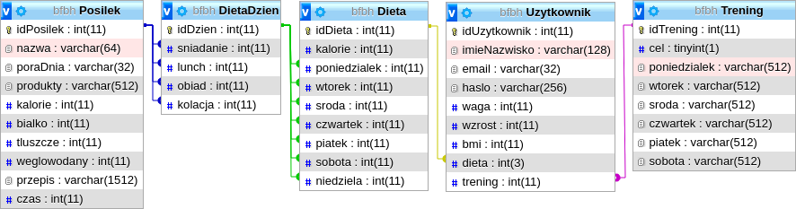

# BeFitBeHealthy

Aplikacja www odpowiedzialna za dobór odpowiedniej diety oraz treningu dla użytkowników.

Strona została zaprojektowana w pełni na architekturze **MVC**.
Część wizualna aplikacji została zbudowana na frameworku [Bulma](http://bulma.io).
Aplikacja wykorzystuje parę autorskich skryptów *javascript* które są odpowiedzialne m.in. za wyświetlanie okienek rejestracji i logowania oraz odpowiedniego dnia treningu/diety na stronie użytkownika.

Dobór odpowiedniej diety wraz z treningiem jest automatycznie podejmowany przez serwer na podstawie danych wprowadzonych przez użytkownika przy rejestracji.
Zalogowani użytkownicy otrzymują dostęp do spersonalizowanej strony użytkownika zawierającej następujące informacje:
* bieżące bmi
* ocena bieżącego bmi
* plan treningu na aktualny tydzień
* plan żywnościowy na aktualny tydzień

Zrzuty ekranu są dostępne w folderze [screenshots](/screenshots).

## Architektura bazy danych
<p align="center">
  
</p>

## Organizacja plików
```
.
├── app
│   ├── controllers
│   │   ├── homepage.php
│   │   └── userpage.php
│   ├── core
│   │   ├── app.php
│   │   ├── controller.php
│   │   └── database.php
│   ├── init.php
│   ├── models
│   │   └── user.php
│   └── views
│       ├── homepage
│       │   └── index.php
│       └── userpage
│           └── index.php
└── public
    ├── css
    │   ├── bulma.css
    │   ├── front_page.css
    │   ├── main.css
    │   ├── normalize.css
    │   └── user_page.css
    ├── favicon.ico
    ├── icon.png
    ├── img
    │   ├── avatar.png
    │   ├── bg_main.png
    │   ├── brain-icon.svg
    │   ├── health_icon.svg
    │   ├── img_fitness.jpg
    │   ├── img_food.jpg
    │   ├── in_thought_banner.svg
    │   ├── logo.svg
    │   ├── strength_icon.svg
    │   └── workout_banner.svg
    ├── index.php
    └── js
        ├── front-page.js
        └── user-page.js
```

## Źródła wykorzystanych zasobów
* bulma.io
* ionicons.com
* pexels.com
